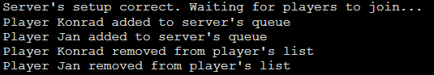
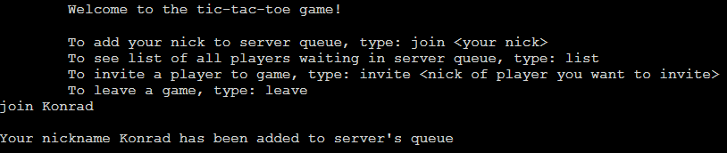
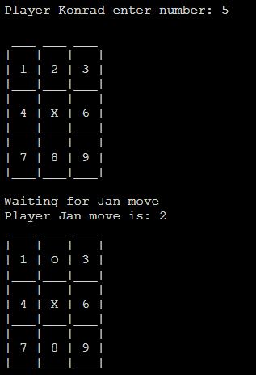
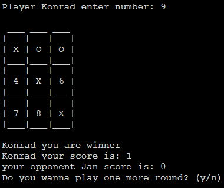

## Multiplayer TicTacToe game
Multiplayer TicTacToe game is based on client-server model using socket programming in C. Server communicates with client to see if they are ready to join. The players in LAN can connect to the server using IPv4 address of server provided. Each connection is opened in a new socket, so it supports any number of simultaneous games. Server is implemented with management of logins.

## Usage
Compiling
```
make all
```
First run the server
```
./server
```

Run clients with server IP

```
./client IPv4
```
## Screenshots





## Authors

* **Jan Kuliga**: [kuliga](https://github.com/kuliga)
* **Konrad Sikora**: [konrad516](https://github.com/konrad516)
* **Krzysztof Bera**: [krzysiubera](https://github.com/krzysiubera)

Gra w kółko i krzyżyk w trybie wieloosobowym

ZAŁOŻENIA:
Gra w kółko i krzyżyk umożliwiająca jednoczesną rozgrywkę wielu osobom korzystającym z urządzeń będących w jednej sieci lokalnej (LAN).

STRUKTURA:
Program serwera współbieżnego będzie uruchomiony na jednej z maszyn, ma odpowiadać m.in. za zestawianie połączeń między dwoma graczami. 
Gracze będą się łączyć z serwerem za pośrednictwem programu klienta, natomiast sama rozgrywka będzie się odbywać trybie Peer to Peer, tj. pomiędzy dwoma maszynami graczy. Gracz będzie mógł m.in. zaakceptować lub odrzucić zaproszenie do gry przez innego gracza.

PROTOKÓŁ WARSTWY TRANSPORTOWEJ:
TCP 

ADRESACJA SIECIOWA:
IPv4

STYL KODU:
https://www.kernel.org/doc/html/v4.10/process/coding-style.html

Autorzy: Jan Kuliga, Krzysztof Bera, Konrad Sikora

Kompilacja (Linux distro): gcc -o server/client -W strmap.c -pthread -std=c99 server.c/client.c
